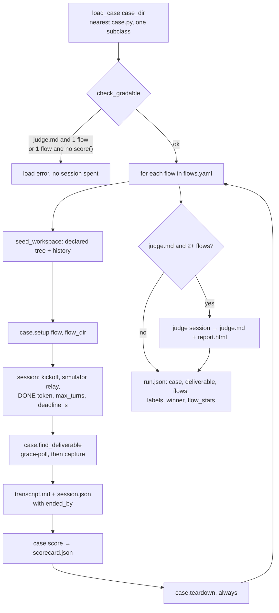

# The case format

A case is a **folder**. Text files are the only source of what the agent, the simulated user
and the judge are told; an optional `case.py` declares the runtime shape — what proves
delivery, how long a flow may run, what happens around it, how it is graded. Everything has a
default, so a folder of text files is already a runnable case:
`flowbench run <case_dir>`.

Vocabulary (Scenario → Case → Flow → Run) is [`../GLOSSARY.md`](../GLOSSARY.md); what the
orchestrator does with a case is [`runner.md`](runner.md).

## The folder

| File | Required | Role |
| --- | --- | --- |
| `task.md` | yes | the kickoff the agent receives; the flow's `prepend`/`append` wrap it (`flowspec.compose_kickoff`) |
| `simulator.md` | yes | the simulated user's persona. It says what *delivered* means for this case, never how to say so — the token is the engine's (see the decision record below) |
| `knowledge.md` | yes | what that user knows, appended to the persona under `--- WHAT YOU KNOW ---`; the agent only ever learns it by asking |
| `flows.yaml` | yes | the flows this case benchmarks, in column order (`flowspec.load_flows`) |
| `judge.md` | no | the comparative rubric. Present = the run ends in a judge stage and a `report.html`; absent = no `_judge/` dir and `winner`/`winner_flow` are `None` |
| `case.py` | no | one `Case` subclass, the folder's runtime shape |
| `seed/` (any name) | no | the starting tree, copied into the flow dir when `case.py` declares it — see "The starting workspace" |
| `setup.sh` / `teardown.sh` | no | run by the default `Case.setup`/`Case.teardown` |

## The `Case` contract

`flowbench.case.Case`. Subclass it in `case.py` and override what the case needs; the base
class is a complete case.

| Member | Default | What it decides |
| --- | --- | --- |
| `deliverable: str \| None` | `None` | the path, relative to the flow dir, that proves this flow delivered. `None` = nothing on disk does (see "Deliverable semantics") |
| `workspace: Workspace` | `Workspace()` | what the flow dir holds before the agent's first turn — see "The starting workspace" |
| `max_turns: int` | `80` | simulator turns before the loop stops |
| `deadline_s: float` | `1800.0` | wall-clock budget for one flow's whole session |
| `async setup(flow, flow_dir)` | runs `setup.sh` | before the flow's session; the flow dir already exists |
| `async teardown(flow, flow_dir)` | runs `teardown.sh` | after it, in a `finally` — it runs even when the session or the scorer raised |
| `async score(flow, flow_dir, session) -> dict \| None` | `None` | this flow's own scorecard, written to `<flow_dir>/scorecard.json`. `None` writes none; an exception is recorded as `{"error": ...}` for that flow and never aborts the run |
| `case_dir: Path` | the folder, resolved | where the text files are read from; `setup.sh`/`teardown.sh` run with it as cwd |
| `name: str` | `case_dir.name` | the run-dir segment: `<runs_root>/<name>/<run_id>` |
| `settings: Settings` | `Settings()` | `runs_root`, `sim_model`, `judge_model` — layered init > `FLOWBENCH_*` env > `.env` > `[tool.flowbench]` > default |
| `validate() -> list[str]` | flow names | the flow names in `flows.yaml` order; reading the file *is* the validation |
| `find_deliverable(flow_dir) -> Path \| None` | see below | the probe the loop polls after DONE and once more after capture |

`setup.sh`/`teardown.sh` see `FLOW_NAME` and `FLOW_DIR` on top of the runner's own
environment; a non-zero exit raises. They do **not** see `.env`: `Settings` reads that file
into itself, not into `os.environ`, so a script that needs a credential from `.env` must be
given it by the environment the runner was launched with. Two more members exist for the
loader, not for cases to call: `judge_path` (`<case_dir>/judge.md`) and
`has_score_override()`, which compares `type(self).score` against the base method — `score`
is a real method, so nothing else can tell.

## Discovery

`load_case(case_dir, settings=None)` walks the case folder and then each ancestor, stopping
**after** the first one named `scenarios` (inclusive) — or at the filesystem root when there is
none. The first `case.py` it finds must define exactly one `Case` subclass, else:

```
{path}: needs exactly one Case subclass, found {n}
```

No `case.py` anywhere on that walk means a plain `Case`. There is no registry: the folder path
is the whole address, which is why variants share a parent — a `case.py` beside `cases/` grades
every case folder under it (difficulty tiers, seeds), and one beside a single case grades only
that case.

Two mechanics that matter to anyone touching this:

- **The file is compiled from its own source text**, not `spec.loader.exec_module`. CPython
  invalidates a cached `.pyc` on `(source mtime-to-the-second, size)`, so a same-size edit
  inside one second is served stale from `__pycache__` — and `flowbench run --rescore` straight
  after editing a scorer is exactly that.
- **The loaded class is never the class you imported.** The module name is keyed by the file's
  path (`flowbench._case_<slug>_<digest>`) so two scenarios' `case.py` cannot shadow each other,
  and `spec_from_file_location` produces a fresh class object each load. Tests assert on
  `type(case).__name__` and on behaviour; `isinstance` against an imported subclass is false by
  construction.

## The starting workspace

Engineering rarely starts from an empty directory, so a case says what its flow dir holds
before the agent's first turn. `flowbench.case.Workspace` is that declaration, and
`run_case` materializes it — for every flow, **before** `Case.setup` — through the one
function `seed_workspace(workspace, case_dir, flow_dir)`.

| Field | Default | What it declares |
| --- | --- | --- |
| `seed: str \| None` | `None` | a directory **inside the case folder**, copied into the flow dir. `None` = the flow dir starts empty |
| `git: bool` | `False` | the tree is a git repo whose single commit holds exactly the seed. `False` = no repo, and the engine creates none |

The default `Workspace()` is a declaration, not a missing one: nothing beyond the
declaration is implied, so a case that wants the agent to set up version control itself
gets a bare directory and whether the agent creates a repo stays an observable. `git` is
the whole of "what history" an in-repo seed can express — one commit; richer history needs
a cloned ref, which brings a network, a cache and credentials with it.

`seed_workspace` is the **single** seeding step: everything the framework puts in the
workspace goes through it, against this one declaration, recorded the same way. A seed that
is missing, is a file, or resolves outside the case folder raises `ValueError` naming the
case folder and the value.

Why it runs before `Case.setup` rather than inside it: an override that forgot to call up
would silently change the workspace, which is exactly the defect the declaration replaces.
`setup` keeps its meaning — extra work *after* the declared workspace exists.

The seed commit is made with the fixed identity `agent-eval <agent-eval@example.com>`, the
message `chore: seed workspace`, signing off, and **pinned author and committer dates**
(`SEED_COMMIT_DATE`), so one declaration produces one SHA in every flow dir and every run.
That is why the record below is one value for the run rather than one per flow. An empty
declaration with `git=True` commits nothing (`--allow-empty`) instead of inventing a
`.gitkeep` the case never declared.

`run.json` records what was materialized, under `workspace`:

| Key | Meaning |
| --- | --- |
| `seed` | the declared directory name, or `null` |
| `git` | whether a repo was declared |
| `seed_files` | how many files the seed tree holds |
| `seed_commit` | the seed commit's SHA, or `null` when no repo was declared |

**A seeded file is not a deliverable.** `find_deliverable` drops any candidate that exists
in the seed tree and still matches it byte for byte — the flow did not produce it — and it
drops them *before* the shallowest-first pick, so an untouched shallow copy cannot hide a
modified deeper one. The comparison is against `<case_dir>/<seed>/<relpath>`, the tree that
is already on disk and versioned with the case, so it needs no manifest and holds for a
`git=False` declaration too. A scorer that wants to diff the whole workspace against its
starting point uses `run.json`'s `workspace.seed_commit`, which inside a flow dir is the
repo's root commit.

## Two load-time errors

`check_gradable(case)` raises, verbatim:

```
{case_dir}/judge.md needs 2+ flows to compare, flows.yaml has {n}
{case_dir}: nothing grades this case — one flow and no score() override (add a second flow to compare, or override Case.score)
```

Both are load-time, and deliberately checked more than once: `load_case` raises for a folder
that already has a `flows.yaml`, `flowbench run` raises again (so a missing `flows.yaml` is the
CLI's own error too), and `run_case`/`run_case_n` raise before building a single factory. A run
that could produce no verdict at all is a configuration mistake; discovering it after an hour of
sessions would be paying for the answer "nothing graded this".

## Deliverable semantics

`find_deliverable(flow_dir)` answers the declared path at the flow-dir root, else its first
nested hit, else nothing. The nested pick is ordered — shallowest first, then lexicographic —
never `rglob`'s first yield, which follows `os.scandir` and varies by filesystem: two nested
copies is ordinary (a subagent's working dir holds one), and an unordered pick would make the
recorded path, the canonical copy and the rendered report differ between machines.

Presence is always `session["artifact_exists"]` — the probe's answer — never the truthiness of
`artifact_text`: an empty file and a directory both have no text. A candidate that is still the seed is
not a candidate at all ("The starting workspace").

| Case | Capture | Judge sees | Report / `run.json` |
| --- | --- | --- | --- |
| **file at the flow-dir root** | found in place; on DONE the loop grace-polls the probe (`artifact_grace_s`, default 60 s) for a write still flushing | the file's text | panel with the text, `artifact_lines` = its line count, `deliverable_path` = where it was found |
| **nested file** | copied to `<flow_dir>/<deliverable>`, parents created, so every reader looks in one place | the same text | `deliverable_path` keeps the nested location, so the original is still reachable |
| **directory** | left where it is — a ported project can be large and copying it would double the run dir | a sorted file listing under `(<name>/ — N files)`, each path relative to the flow dir (`work/port/a.sql`), so a nested directory's files stay locatable | a listing panel; `artifact_lines` is omitted — it is a file measure — so the report counts the listing's lines |
| **none declared** (`deliverable = None`) | no probe is built, no grace poll | `(no deliverable declared)` — the flows are compared on their conversations alone | no panel, no line count, and no `artifact_missing`/`artifact_lines` keys in `run.json` |

A declared deliverable the flow never produced is not a crash: the judge is shown
`(this flow produced no <name> — treat it as a failed run)` and the flow's name lands in
`run.json`'s `artifact_missing`.

## Lifecycle



## What `Case` deliberately does not have (YAGNI)

The surface above is closed. Rejected for this story, each with the trigger that would reopen it:

- **Per-turn hooks (`on_turn`, `is_done`).** The loop's boundary is an idle turn and its exit is
  the engine's token; a case that wants to inspect every turn has no use for it yet. Trigger: the
  divergence-traps case, which may need to score mid-conversation.
- **A case-defined simulator object.** `simulator.md` + `knowledge.md` are the persona, and text
  is what keeps a case readable by a non-programmer. Trigger: a case whose user must run code to
  answer.
- **Multi-stage cases.** The ADF X-Lens → X-Port chain is a real requirement and a real design
  question (`../roadmap/current-state.md`, "Capability gaps"); a stage list bolted onto `Case`
  now would prejudge it.
- **A registry, or a scenario-level rules module above the case.** The path is the address; a
  registry adds a name to keep in sync with a folder that already has one, and a rules layer above
  the case has nothing left to hold now that `case.py` can sit at any level of the walk.
- **A per-case done token.** See
  [`decisions/2026-09-10-completion-is-engine-owned.md`](decisions/2026-09-10-completion-is-engine-owned.md).
