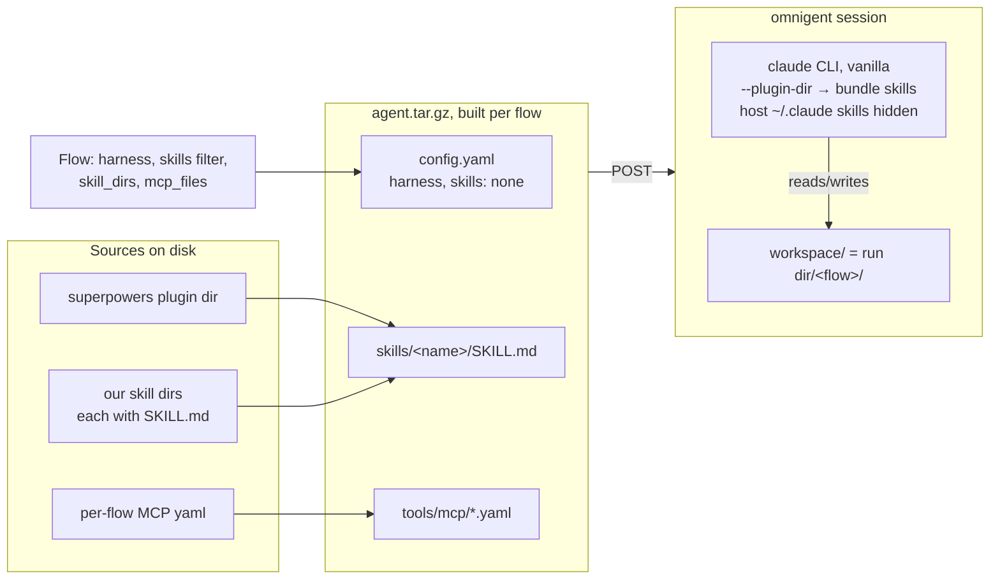

# Runner design

The engine's execution core is `driver.py` + `loop.py`; `run.py` orchestrates a case
on top of them. Scenarios own content and scenario-specific scoring only.

## driver.py — the ONE module that knows omnigent exists

- `AgentDriver` (ABC): `start / send / capture_session / artifact_path / close`.
  All spawning goes through implementations of this seam; scenarios and tests
  inject fakes.
- `OmnigentDriver`: spawns a vanilla-Claude-Code agent as an omnigent session
  (HTTP + `omnigent_client`), per-session `model`, `reasoning_effort`,
  `harness`, `skills`, `cwd`. Guards `ANTHROPIC_API_KEY` UNSET (subscription
  billing). `close()` leaves the omnigent session/runner/tmux alive on purpose
  — a human resumes via `conversation_url`; only HTTP clients are closed.
- `capture_session()` returns plain data: `items`, `events`, `duration_s`,
  `artifact_*`, `model`, `session_id`, `conversation_url`.

### Where a flow's skills live at run time

A flow's skills never load from the host `~/.claude`. `OmnigentDriver._build_bundle`
copies them into a per-flow tarball, POSTs it to omnigent, and the agent loads them from
there (`--plugin-dir`); with `skills: "none"` the host skills are hidden. That is what
makes a flow identical on any machine.

Baseline is the same picture with an empty `skills/`. Nothing else changes.

## loop.py — the mediated DONE-token loop

`run_agent_session(driver, user_model, *, first_prompt, simulator_system,
done_token, max_turns, deadline_s)`:

- Only an `idle` turn is a clean boundary; `failed`/`timeout`/`running` stops
  the loop and scores what was built.
- The simulator is any `user_model` with `async generate(prompt)`; the loop
  composes `simulator_system` + conversation tail per call.
- Self-wait turns (agent parked on its own busy sub-agent, not asking anything)
  get a free "Continue." nudge, capped at 3 consecutive, so the simulator isn't
  burned polling.
- **The loop closes the driver itself** (finally). Callers close only their
  simulator.

## run.py — the `run_case` orchestrator (since S01.1)

`run_case(case_dir, *, run_id, runs_root, scenario, make_flow_driver, make_simulator,
run_judge, done_token=DONE_TOKEN, score_flow=None, ...)`: for each flow spawn a driver +
simulator, run the loop (against `done_token`, a per-case override — todo_app's is
`<<DONE>>`), write `<run_root>/<flow>/{plan.md,transcript.md,session.json}`, then (since
S01.3) judge all flows in one shot and write `run.json` + `report.html` — but ONLY if
`case_dir/judge.md` exists. A case with no `judge.md` (a build-shaped case like todo_app,
scored per-flow rather than comparatively) skips the judge stage entirely: no `_judge/`
dir, no `report.html`, `run.json`'s `winner`/`winner_flow` are `None`. In that shape
`score_flow(flow, flow_dir, session) -> dict`, when given, runs after each flow's own
session and its result is written to `<flow_dir>/scorecard.json`; a raised exception is
caught and recorded as `{"error": ...}` (plus `flow_stats[name].score_error`) rather than
aborting the run — `report/compare.py` reads that shape as a FAILED column with the
reason. `run_case_n` repeats `run_case` with the flow list rotated per trial (cancels
judge position bias) under `trial-XX/` and aggregates; with no judge across all trials the
aggregate is `{"counts": {}, "winner": None}` rather than tallying `None` as a flow name.
The three factories are injected so the whole pipeline runs offline against
`flowbench.testing` doubles; `omni_factories(scenario, *, artifact_name="plan.md",
git_init=False)` returns the real ones (todo_app binds `artifact_name="tasks.json",
git_init=True`).

Supporting modules, all omnigent-free at import time:

| Module | Role |
| --- | --- |
| `model.py` | `SessionModel`: `.generate(prompt)` shim over one persistent omnigent session (simulator + judge); freshness-retry policy for the terminal-readiness flake |
| `flowspec.py` | `load_flows` (flows.yaml, resolves `skill_dirs`), `compose_kickoff` (prepend + task + append) |
| `runner/judge.py` | `parse_verdict`/`parse_scores` for the prose `WINNER:`/`SCORES X:` tail, `build_judge_prompt`, `aggregate_*`, `last_json_object` for JSON judges |
| `transcript.py` | message-item helpers shared by driver and reports (`item_text`, `dedup_items`, ...) + `render_transcript` |
| `report/run_report.py` | run dir → self-contained `report.html` (single run and aggregate) |
| `watch.py` | `RunWatch`: incremental anomaly scanner over a live run (omnigent log + run dir) |
| `testing.py` | `FakeDriver`, `StubSim`, `MissingPlanDriver`, `ScriptedDriver`, `n_run_factories` |

Case-shaped constants (`MISSING_PLAN`, `SIM_MODEL`, `JUDGE_MODEL`) are still module
constants of `run.py`; `DONE_TOKEN` and the flow driver's `artifact_name`/`git_init` are
now per-call overrides (S01.3), defaulting to swe_planning's values. CLI entrypoints
(`main`) stay scenario-side until S03.x.

## One execution model

Scenarios run through the engine's `run_case` orchestrator — not through Inspect
(true for both scenarios as of S01.3, todo_app's port). `subscription_model.py`
(`claude -p`) and the `inspect-ai` dependency still exist but are unused; their
removal is S01.4 (same issue, PR 2).
Decision record: flowbench-scenarios
`docs/superpowers/specs/2026-07-02-swe-planning-rework-design.md` (execution
model + framework strategy + reconsider-triggers).

## Seams are plain files

Run folders (`../flowbench-runs/...`) hold `run.json`, `scorecard.json`,
transcripts. Future tooling (reports, stats, even an Inspect log exporter for
`inspect view`) reads these files; it never wraps execution.
