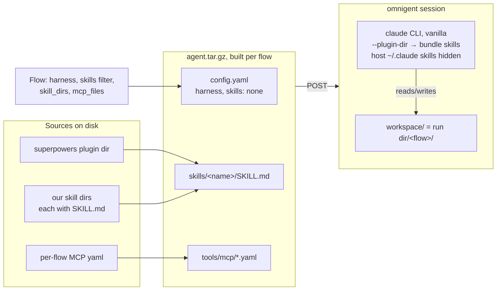

# Runner design

The engine's execution core is two modules; everything else is scenario-local.

## driver.py — the ONE module that knows omnigent exists

- `AgentDriver` (ABC): `start / send / capture_session / artifact_path / close`.
  All spawning goes through implementations of this seam; scenarios and tests
  inject fakes.
- `OmnigentDriver`: spawns a vanilla-Claude-Code agent as an omnigent session
  (HTTP + `omnigent_client`), per-session `model`, `reasoning_effort`,
  `harness`, `skills`, `cwd`. Guards `ANTHROPIC_API_KEY` UNSET (subscription
  billing). `close()` leaves the omnigent session/runner/tmux alive on purpose
  — a human resumes via `conversation_url`; only HTTP clients are closed.
- `capture_session()` returns plain data: `items`, `events`, `duration_s`,
  `artifact_*`, `model`, `session_id`, `conversation_url`.

### Where a flow's skills live at run time

A flow's skills never load from the host `~/.claude`. `OmnigentDriver._build_bundle`
copies them into a per-flow tarball, POSTs it to omnigent, and the agent loads them from
there (`--plugin-dir`); with `skills: "none"` the host skills are hidden. That is what
makes a flow identical on any machine.

Baseline is the same picture with an empty `skills/`. Nothing else changes.

## loop.py — the mediated DONE-token loop

`run_agent_session(driver, user_model, *, first_prompt, simulator_system,
done_token, max_turns, deadline_s)`:

- Only an `idle` turn is a clean boundary; `failed`/`timeout`/`running` stops
  the loop and scores what was built.
- The simulator is any `user_model` with `async generate(prompt)`; the loop
  composes `simulator_system` + conversation tail per call.
- Self-wait turns (agent parked on its own busy sub-agent, not asking anything)
  get a free "Continue." nudge, capped at 3 consecutive, so the simulator isn't
  burned polling.
- **The loop closes the driver itself** (finally). Callers close only their
  simulator.

## One execution model

Scenarios run through a scenario-local `run_case` orchestrator on top of these
two modules — not through Inspect. `subscription_model.py` (`claude -p`) and
the `inspect-ai` dependency are scheduled for removal via the todo_app port.
Decision record: flowbench-scenarios
`docs/superpowers/specs/2026-07-02-swe-planning-rework-design.md` (execution
model + framework strategy + reconsider-triggers).

## Seams are plain files

Run folders (`../flowbench-runs/...`) hold `run.json`, `scorecard.json`,
transcripts. Future tooling (reports, stats, even an Inspect log exporter for
`inspect view`) reads these files; it never wraps execution.
