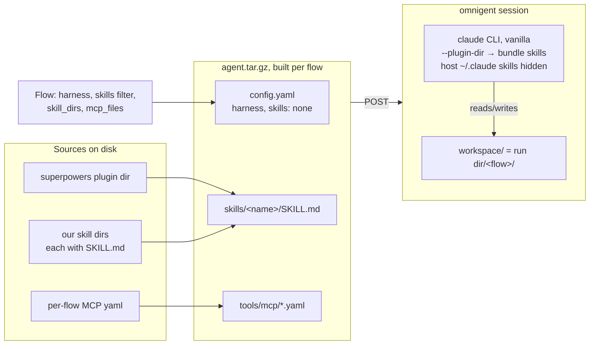

# Runner design

The engine's execution core is `flowbench/driver/` + `flowbench/loop.py`; `run.py`
orchestrates a case on top of them. A case owns its content and its own scoring
(`case.py`); the engine owns everything generic.

The war-story comments in `driver/` and `loop.py` are load-bearing: each encodes a live
incident (lying idle, undelivered injection, empty grader completion). A refactor carries the
constraint and its regression test, not just the code.

## flowbench/driver/ — the ONE package that knows omnigent exists

Split out of the old `runner/driver.py` in E02 S02.2. `flowbench.runner.driver`
and `flowbench.runner.loop` re-export the old names for one release.

| Module | Holds |
| --- | --- |
| `base.py` | `AgentDriver` ABC |
| `bundle.py` | `render_config` / `build_bundle` / `session_metadata` — pure functions of a `BundleSpec` |
| `omnigent.py` | `OmnigentDriver`: lifecycle, send/settle, capture, URLs, `git_init_repo` |

- `AgentDriver` (ABC): `start / send / capture_session / close`.
  All spawning goes through implementations of this seam; scenarios and tests
  inject fakes.
- `OmnigentDriver`: spawns a vanilla-Claude-Code agent as an omnigent session
  (HTTP + `omnigent_client`), per-session `model`, `reasoning_effort`,
  `harness`, `skills`, `cwd`. Guards `ANTHROPIC_API_KEY` UNSET (subscription
  billing). `close()` leaves the omnigent session/runner/tmux alive on purpose
  — a human resumes via `conversation_url`; only HTTP clients are closed.
- `capture_session()` returns plain data: `items`, `events`, `duration_s`,
  `model`, `session_id`, `conversation_url`. The artifact keys
  (`artifact_exists`/`artifact_path`/`artifact_text`) are added by the loop, not the
  driver — see "Artifact probe" below.

### Where a flow's skills live at run time

A flow's skills never load from the host `~/.claude`. `flowbench.driver.bundle.build_bundle`
copies them into a per-flow tarball, POSTs it to omnigent, and the agent loads them from
there (`--plugin-dir`); with `skills: "none"` the host skills are hidden. That is what
makes a flow identical on any machine.

Baseline is the same picture with an empty `skills/`. Nothing else changes.

### Send/retry policy

`OmnigentDriver.send` is the only place that decides whether a turn is re-sent; callers —
the loop, `SessionModel`, scripts — read `TurnResult.status` and never re-derive it.

| Observation | Meaning | Action |
| --- | --- | --- |
| `FAILED` + label says undelivered | injection never landed | wait, re-send same text (bounded) |
| `FAILED` + new assistant text | turn completed, then flaked | trust the text, no retry |
| `FAILED`, no label, no new text | unknown; likely undelivered | bounded re-send (the #39 behavior, generalized) |
| `TIMEOUT` | may be mid-turn after delivery | NEVER retry (injecting into a busy terminal kills sessions) |
| `IDLE` + no new text past settle budget | lying idle | report `TIMEOUT` |
| any status + the new text is a CLI limit banner | the subscription/rate wall, not a reply | report `QUOTA` with the banner as text; never re-sent |

Precedence and mechanics: "new assistant text" is checked first, so row 2 never reads a
label; a new reply is `transcript.new_assistant_text(items, n_before)` — a NON-EMPTY
assistant message beyond the count taken before the inject (an empty new message is not
a reply; it would let an older one pass as this turn's). Rows 1 and 3 are decided by one
label read in `_resend_allowed`: no error code, or `runner_error` + "not delivered" →
re-send; any other present code (a delivered failure such as `model_error`), or an
unreadable label → no re-send. A row-2 turn returns as `status=IDLE, flaked=True` and
prints one `[flowbench] turn flaked` line; the loop counts them into
`session["flaked_turns"]`. Row 6 is checked before every other row: a banner as the new
assistant text (`transcript.is_quota_banner` — anchored to the message start, ≤ 240 chars,
the only signal the server gives; every `omnigent.last_task_error_*` label was empty in
`s025p2-620b16b`) is `QUOTA` whether the server said failed or idle, so a FAILED + banner is
not row 2. The driver prints one `[flowbench] quota: <banner>` line, the loop stops the
session with `exit_status: "quota"`, and `flowbench.watch` prints one `QUOTA: <title> (<id>)
<banner>` per session (it reads each run session's last item).

**One wall-clock budget per send.** `deadline = now + turn_timeout_s`, taken once at the
top of `send`; `_wait_idle`, the settle loop and the retry sleeps all draw it down, a
re-send happens only while the remaining budget exceeds `send_retry_wait_s`, and every
inject is preceded by a deadline check. The whole send also runs under
`asyncio.timeout(turn_timeout_s)`, so a server call, back-off, label read or retry sleep
still in flight at the cap is abandoned — the await is cancelled — and the send reports
`TIMEOUT` with empty text. At the cap the status is `RUNNING` (or an undocumented server
status, verbatim) if the soft loop got there first, `TIMEOUT` if the timer did — both mean
the turn did not finish.

**Artifact probe.** The driver knows nothing about artifacts. `run_agent_session` takes
`artifact_probe: Callable[[], Path | None] | None` — the orchestrator's answer to "which
file proves this session delivered". With a probe, the DONE branch polls it every 2 s in a
worker thread (`asyncio.to_thread`) under `asyncio.timeout(artifact_grace_s)`: an agent that
announces completion while its write is still flushing gets the grace; a hung filesystem
ends the poll, not the run (the abandoned thread finishes on its own). After
`capture_session()` the loop probes once more and sets `artifact_exists`, `artifact_path`
and `artifact_text` on the session — for every session, `False/None/None` without a probe,
so `session.json` has one shape. `run.py` owns the probe: `case.find_deliverable` bound to
the flow dir, and only when the case declares a deliverable (`case.deliverable is not None`);
simulator, judge and grader sessions never see one. What the probe looks for, and what a
file/nested file/directory/nothing each mean downstream, is [`case.md`](case.md).

## loop.py — the mediated DONE-token loop

`run_agent_session(driver, user_model, *, first_prompt, simulator_system, max_turns=80,
deadline_s=1800.0, artifact_grace_s=60.0, artifact_probe=None)`:

- **The engine owns the done token.** `DONE_TOKEN = "<<DONE>>"` is a module constant, not a
  parameter and not a case field; `prime_prompt` appends the instruction to use it to the
  simulator's persona. A case's `simulator.md` says what *delivered* means and never names a
  token. Decision record:
  [`decisions/2026-09-10-completion-is-engine-owned.md`](decisions/2026-09-10-completion-is-engine-owned.md).

- Only an `idle` turn is a clean boundary; any other `TurnStatus` stops the loop
  and scores what was built. The vocabulary lives in `flowbench/types.py`:

  | member | meaning | produced by |
  | --- | --- | --- |
  | `IDLE` | turn settled: the agent is awaiting the user | omnigent server |
  | `RUNNING` | still mid-turn when the per-turn cap fired | omnigent server |
  | `FAILED` | the omnigent session reported failed | omnigent server |
  | `TIMEOUT` | idle but silent, or the send's budget expired | `send` / `_send_once` |
  | `STALLED` | a prompt nobody can answer, or no heartbeat | `_send_once` |
  | `QUOTA` | the CLI's limit banner was the turn's only output | `_send_once` |

  `stalled` is the driver's watchdog
  (`stall_s`, default 300 s): a `running` session waiting on a human (a pending
  elicitation or `terminal_pending` — permission, policy, trust or login prompt nobody
  can answer; NOT `pending_inputs`, which is our own queued message) ends the turn at once as `prompt`; one whose
  `updated_at` heartbeat is silent for `stall_s` ends it as `no_progress`. The
  session records `exit_status`, `stall_reason` and `pane_tail` (the terminal's
  last lines, i.e. the question it is stuck on). The watchdog never answers the
  prompt: a benchmark that resolves its own prompts measures the harness, not
  the flow. `flowbench.watch` prints `STALLED (...)` on the same signals. `prompt` can fire
  under `bypassPermissions` for an operational reason, not a flow's: see `docs/onboarding.md`,
  "No server restart under a run".
- **`session["ended_by"]` says why the session stopped**, next to `exit_status`, which says what
  the agent's last turn was doing. Precedence, first match wins:

  | `ended_by` | when |
  | --- | --- |
  | the terminal status, verbatim (`failed`, `timeout`, `quota`, …) | the final turn was not `idle` — a crashed session is not a completed one, whatever the simulator said |
  | `done` | the simulator emitted the token |
  | `max_turns` | the turn cap was reached |
  | `deadline` | idle, uncapped, no token: the wall clock |

  Without it the exit was invisible: 50 of 69 recorded sessions ended `idle` and the record could
  not say whether the simulator or a budget stopped them.
- The simulator is any `user_model` with `async generate(prompt)`; the loop
  composes `simulator_system` + conversation tail per call.
- An idle main agent with a busy sub-agent (`GET /v1/sessions/{id}/child_sessions`,
  per-child `busy`) is still mid-turn: the driver keeps waiting, with the children's
  `updated_at` folded into the heartbeat, and reports `idle` only once no child is busy
  and, once children have cleared, only after the task-notification wake-up turn has run
  (or `child_wake_s`, 20 s, has passed) so the inject never queues behind it.
  The loop therefore never nudges; every idle turn is a real hand-over to the simulator.
  (#67 — the old "Continue." nudge burned turns and items, and its sentinel collided
  with a simulator that itself answered "Continue.", freezing the relay cursor.)
- `_list_items` pages past the server's 200-item cap (#4/#67): an unpaginated read
  froze the settle check once a session outgrew one page, and every later turn burned
  the whole turn cap.
- **The loop closes the driver itself** (finally). Callers close only their
  simulator.

## run.py — the `run_case` orchestrator (takes a `Case` since S03.2)

`run_case(case, *, run_id, make_flow_driver, make_simulator, run_judge, runs_root=None,
artifact_grace_s=60.0, rotation=0)`. What is benchmarked is a **`Case`** — the case folder's
runtime shape: what proves delivery, the budgets, what happens around a flow, how it is graded.
The contract and the folder format are [`case.md`](case.md); this section is what the
orchestrator does with one.

Per flow, in `flows.yaml` order (rotated left by `rotation % N` so multi-trial runs cancel judge
position bias):

1. `case.setup(flow, flow_dir)`.
2. the session — a flow driver plus a simulator, run through `run_agent_session` with
   `case.max_turns`, `case.deadline_s` and, when the case declares a deliverable, an
   `artifact_probe` bound from `case.find_deliverable`.
3. deliverable capture: a nested file is copied to `<flow_dir>/<deliverable>` so every reader
   looks in one place, and where it was *found* is recorded as
   `flow_stats[flow].deliverable_path`; a directory stays where it is.
4. `<flow_dir>/transcript.md` and `<flow_dir>/session.json` (the latter carrying `ended_by`).
5. `case.score(flow, flow_dir, session)` → `<flow_dir>/scorecard.json`. `None` writes no card;
   an exception is recorded as `{"error": ...}` plus `flow_stats[flow].score_error` rather than
   aborting the run — `report/compare.py` reads that shape as a FAILED column with the reason.
6. `case.teardown(flow, flow_dir)`, in a `finally`, so it runs even when a stage above raised.

Then the judge, but ONLY if `case.judge_path` exists: all flows in one shot →
`run.json` + `report.html`. A case with no `judge.md` (a build-shaped one like todo_app, scored
per-flow instead) skips the stage entirely: no `_judge/` dir, no `report.html`, and
`winner`/`winner_flow` are `None`. `check_gradable(case)` runs before any factory is built, so a
run nothing could grade fails without spending a session.

**Run layout.** `<runs_root>/<case.name>/<run_id>`, `runs_root` falling back to
`case.settings.runs_root`; `run_case_n` with `n > 1` adds `trial-XX/` under it and writes an
aggregate `run.json`. With no judge across all trials the aggregate is
`{"counts": {}, "winner": None}` rather than tallying `None` as a flow name. Every session label
is read back off that layout (`_run_parts`/`_title`/`_project`): the web-UI project is
`<case>/<run_id>` and a title carries the case and, under `n > 1`, the trial — nothing a caller
has to pass in and keep consistent. `run.json` records `case` and `deliverable`.

**Factories** are injected so the whole pipeline runs offline against `flowbench.testing`
doubles; `omni_factories(case)` returns the real three, and the only thing the case chooses in
them is the models (`settings.sim_model`, `settings.judge_model`; a flow names its own). A case
that needs a git repo in the flow dir makes one in its own `setup`.

`rescore_run(case, run_root)` re-runs `case.score` over an existing run dir — the flat `n=1`
dir and each `trial-XX/` — from what is on disk (`<flow>/session.json` + the case's current
`flows.yaml`), rewriting `scorecard.json` and `flow_stats[flow].score_error` and deleting a card
whose fresh score is `None`. No new session, no factory, transcripts untouched. It is what
`flowbench run --rescore <run_id>` calls.

Supporting modules, all omnigent-free at import time:

| Module | Role |
| --- | --- |
| `model.py` | `SessionModel`: `.generate(prompt)` shim over one persistent omnigent session (simulator + judge); send, raise on a non-idle or empty result, wrap the completion |
| `flowspec.py` | `load_flows` (flows.yaml, resolves `skill_dirs`), `compose_kickoff` (prepend + task + append) |
| `runner/judge.py` | `parse_verdict`/`parse_scores` for the prose `WINNER:`/`SCORES X:` tail, `build_judge_prompt`, `aggregate_*`, `last_json_object` for JSON judges |
| `transcript.py` | message-item helpers shared by driver and reports (`item_text`, `dedup_items`, ...) + `render_transcript` |
| `report/run_report.py` | run dir → self-contained `report.html` (single run and aggregate) |
| `watch.py` | `RunWatch`: incremental anomaly scanner over a live run (omnigent log + run dir), plus `RunWatch.locate(run_id, runs_root)` — the one run dir with that id under any case — and `follow(watch, *, pid, interval, out)`, the tick loop that exits on `run.json` or a dead runner |
| `case.py` | `Case`, `load_case`, `check_gradable`, `scenarios_root` — see [`case.md`](case.md) |
| `settings.py` | `Settings`: `runs_root`, `sim_model`, `judge_model` |
| `testing.py` | `FakeDriver`, `StubSim`, `MissingPlanDriver`, `ScriptedDriver`, `n_run_factories` |

## cli.py — `flowbench run | watch | compare`

| Command | Does |
| --- | --- |
| `flowbench run CASE_DIR [--n N] [--run-id ID] [--runs-root PATH] [--sim-model M] [--judge-model M] [--rescore RUN_ID]` | `load_case(CASE_DIR)` → `run_case_n` under the real omnigent factories, and prints the trial meta (`--n 1`) or the aggregate tally plus the run dir. `--rescore` re-scores that existing run id instead, starting no session. There are no budget flags: `max_turns` and `deadline_s` are the case's |
| `flowbench watch RUN_ID [--runs-root PATH] [--pid N] [--interval S]` | `RunWatch.locate` finds the run dir under any case, then `follow` streams one line per anomaly until `run.json` lands (or `--pid` dies) |
| `flowbench compare --run-base B --run-id ID [--out FILE]` | the side-by-side scorecard table from `<B>/<ID>/*/scorecard.json` (unchanged) |

A load-time error — either of the two gradability messages in [`case.md`](case.md), or an
unreadable case folder — is the CLI's own output: the message on stderr, exit 1, never a typer
usage error, whose exit 2 would read as a mistyped command.

**Settings precedence**, one layered `Settings` object (`pydantic-settings`): a flag beats
`FLOWBENCH_*` in the environment, which beats `.env`, which beats `[tool.flowbench]` in
`pyproject.toml`, which beats the default (`runs_root=runs`, `sim_model=judge_model=opus`). A
flag that was not passed is left out of the `Settings` call, so it never shadows a lower layer.
The resolved object reaches the case as `case.settings` — `load_case(case_dir, settings)` passes
it through, and a `Case` built without one constructs its own.

## One execution model

Every case runs through the engine's `run_case` orchestrator — not through Inspect
(true for both scenarios as of S01.3, todo_app's port; the Inspect-based path was
removed entirely in S01.4).
Decision record: flowbench-scenarios
`docs/superpowers/specs/2026-07-02-swe-planning-rework-design.md` (execution
model + framework strategy + reconsider-triggers).

## Seams are plain files

Run folders (`../flowbench-runs/...`) hold `run.json`, `scorecard.json`,
transcripts. Future tooling (reports, stats, even an Inspect log exporter for
`inspect view`) reads these files; it never wraps execution.
